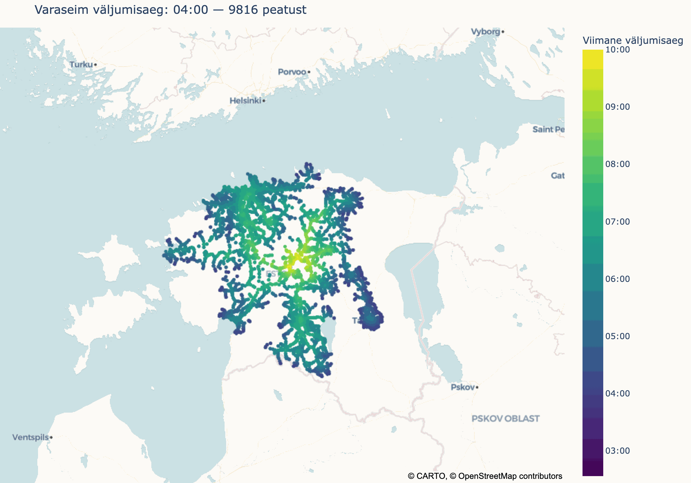

# Arvamusfestival_2026
See programm illustreerib, kui ebamugav on ühistransporti kasutades saada Paide Arvamusfestivalile.

Et programmi jooksutada tuleb laadida alla "Eesti ühistranspordiliinide koondandmed" [siit:](https://peatus.ee/content/Veebilehest%20ja%20%C3%BChistranspordi%20avaandmetest) ja siis _constants.py_ failis path ära vahetada.

_Default_ parameetrid on: 
1) saabumise kuupäev: 08.08.2026
2) saabumise kellaaeg: 10:00
3) minimaalne aeg ümberistumiseks: 2.5 minutit
4) maksimaalne kõnnitav distants peatuste vahel: 5 km
5) kõndimiskiirus: 5 km/h
6) maksimaalne ümberistumiste arv: 4
7) kõige varajasem väljumine: 07:00
8) üheks koondatud peatuste (klastrite) raadius: 0 km

Kõiki parameetreid saab _constants.py_ failis muuta. Lisaks on võimalik muuta ka sihtkohta(sid), aga selleks tuleb leida vastavate peatuse id-d.

Lisaks on võimalik luua gif, kus muutuv parameeter on väljumisaeg (_make_gif.py_). 

## Näited
gif, varaseim stardiaeg on muutuv. paremal olev _bar_ näitab, mis on hilisem aeg (mis ei ole enne varaseimat stardiaega), millal saab veel väljuda:

[pool-interaktiivne plotly kaart](https://ri74ki74.github.io/Arvamusfestival_2026/src/map.html)

